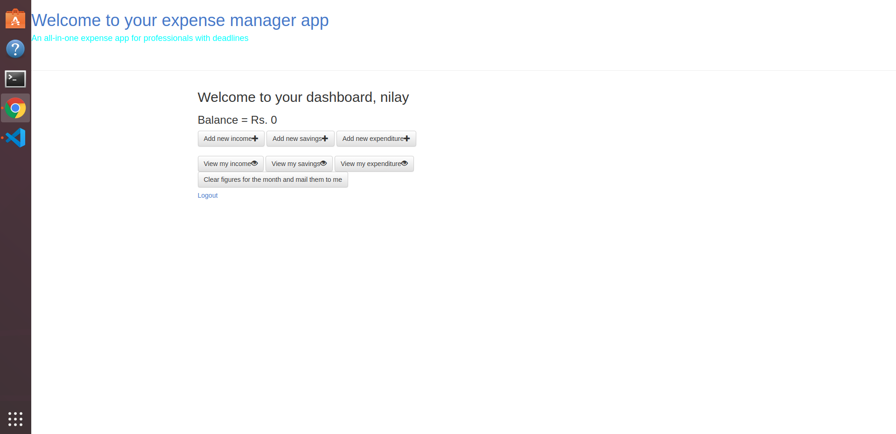
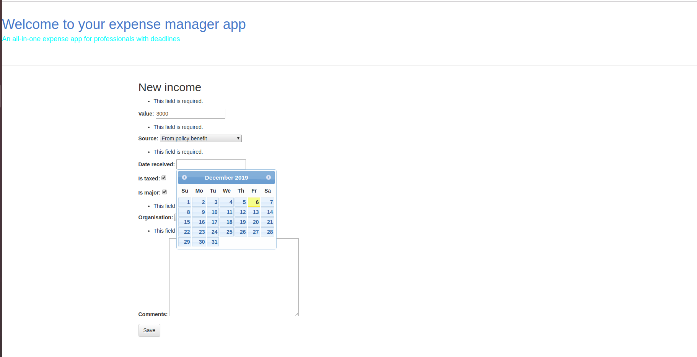
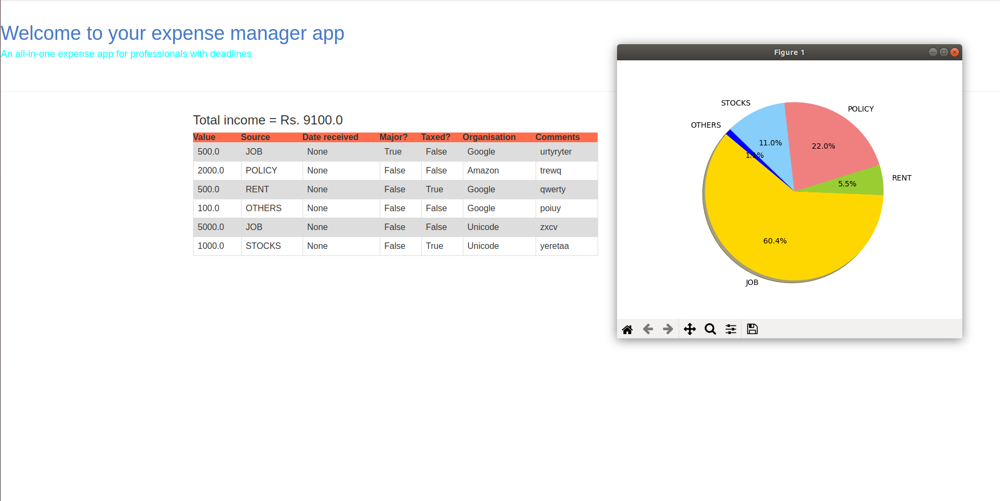

# Expense manager app
## An web app for tracking income, savings, expenditure

### Dashboard:

---

### Adding a new income:

---

### Viewing your incomes:

---

### Getting notification emails
When the account is low of savings, user gets an email with the current savings and balance amount.
There is also a feature where-in user can clear the figures for the current month and start afresh for the new month.
They will receive a mail that summarizes their income, savings, and expenditure for the current month. They can also download the pie-charts to their PC or save it in drive.

---
